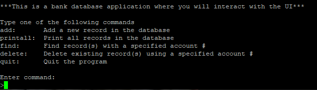

  

This C++ program uses object-oriented programming concepts like polymorphism and dynamic memory allocation by using Pokemon objects that were derived from a base Pokemon class. The program uses pointers to store instances of these Pokemon subclasses (Pikachu, Squirtle, and Charmander) in the heap memory. Separate C++ files were created along with header files for each of the Pokemon. Each class was separately defined and linked together when compiling. In the main file, the Pokemon are created in the heap memory and a nickname is given to each pokemon. Then there is a vector container that stores these three nicknames. It creates a map container that stores these Pokemon pointers by their corresponding nicknames as keys. The main file also verifies that everything works by using each of the elements of the vector container to access the corresponding item stored in the map container.

This project was created for my ICS 212 class. We were given instructions on the program requirements, however, there was some room for creativity on how to complete this assignment. This program was developed using Vim in a terminal by connecting to the UHUNIX server through SSH. For this assignment, we also had to make a Makefile to automate. The compilation process

Through this project, I learned much more about polymorphism and how to implement classes in C++. I knew why header files are important and how memory in the heap works. Working through all these concepts through a terminal instead of a modern IDE gave me a much deeper understanding since I had to rely on my problem-solving skills rather than a modern IDE telling me if I made an error. This experience expanded my overall knowledge of C++ and I found this assignment to be interesting.

You can view the source code [here](https://github.com/jstnsmth/ICS212/tree/main/homework8).
