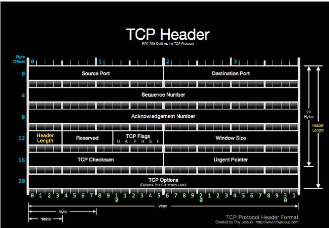
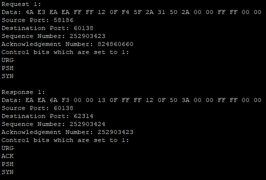

<div class="text-center p-4">
  
  
</div>

This C program reads binary files that contain TCP headers, prints their contents, and generates corresponding response headers which are written into separate binary files. This program performs key operations like reading binary data, interpreting this data displaying TCP header fields, and creating response headers by adjusting ports, sequence numbers, and control bits as they are needed. Once the data is processed, it will write generated response headers into separate binary files. Below is the printhead function that:

```c
void printheader(const unsigned char data[])
{
    int i;
    char flags[6][4] = {"URG", "ACK", "PSH", "RST", "SYN", "FIN"};
    unsigned int seqNum = (data[7] << 24) | (data[6] << 16) | (data[5] << 8) | data[4];
    unsigned int ackNum = (data[11] << 24) | (data[10] << 16) | (data[9] << 8) | data[8];

    printf("Data: ");
    for (i = 0; i < 20; i++)
    {
        printf("%02X ", data[i]);
    }
    printf("\nSource Port: %d\n", (data[1] << 8) | data[0]);
    printf("Destination Port: %d\n", (data[3] << 8) | data[2]);
    printf("Sequence Number: %u\n", seqNum);
    printf("Acknowledgement Number: %u\n", ackNum);
    printf("Control bits which are set to 1:\n");

    for (i = 0; i < 6; i++)
    {
        if (data[13] & (1 << (5-i)))
        {
            printf("%s\n", flags[i]);
        }
    }
}
```

This project was created for my ICS 212 class, we were given the request data and instructions on how to use this data to generate response data. We were told what the expected output was supposed to be and it was our job to figure out how to achieve the desired output using bit manipulation. This program was also developed using Vim in a terminal by connecting to the UHUNIX server through SSH. This made the assignment harder since I had to debug everything rather than relying on a modern IDE manually.

After completing this project, I have a much deeper understanding of reading and manipulating bits and how TCP headers function. This hands-on experience with binary file operations and TCP protocol details has increased my ability to work with low-level data structures and networking concepts. This project also helped improve my skills in debugging and problem-solving which provides a more solid foundation for more advanced programming tasks.

You can view the source code [here](https://github.com/jstnsmth/ICS212/tree/main/homework7).
