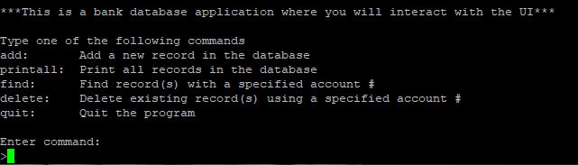

<div class="text-center p-4">
  
</div>

This C program reads binary files that contain TCP headers, prints tehir contents and generates corresponding response headers which are written into separate binary files. This prgoram ferforms  key operations ike reading binary data, interpreting this data and displaying TCP header fields and creating response headers by adujsting ports, sequence numbers and control bits as they are needed. Once the data is processed, it will write generated response headers into separate binary files. Below is the printheader function that:

```c
void printheader(const unsigned char data[])
{
    int i;
    char flags[6][4] = {"URG", "ACK", "PSH", "RST", "SYN", "FIN"};
    unsigned int seqNum = (data[7] << 24) | (data[6] << 16) | (data[5] << 8) | data[4];
    unsigned int ackNum = (data[11] << 24) | (data[10] << 16) | (data[9] << 8) | data[8];

    printf("Data: ");
    for (i = 0; i < 20; i++)
    {
        printf("%02X ", data[i]);
    }
    printf("\nSource Port: %d\n", (data[1] << 8) | data[0]);
    printf("Destination Port: %d\n", (data[3] << 8) | data[2]);
    printf("Sequence Number: %u\n", seqNum);
    printf("Acknowledgement Number: %u\n", ackNum);
    printf("Control bits which are set to 1:\n");

    for (i = 0; i < 6; i++)
    {
        if (data[13] & (1 << (5-i)))
        {
            printf("%s\n", flags[i]);
        }
    }
}
```

This project was created for my ICS 212 class, we were given the request data and instructions on how to use this data to generate response data. We were told what the expected output was supposed to be and it was our job to figure out how to achieve the desired output using bit manipulation. This program was also developed using Vim in a terminal by connecting to the UHUNIX server through SSH. This made the assignment harder since I had to manually debug everything rather than relying on a modern IDE.

After completing this project, I 

Through this project, I gained a deeper understanding of C by compiling multiple files, implementing linked lists, and managing file I/O. Also, Working without the conveniences of modern IDEs taught me valuable debugging skills, relying only on manual error tracing without line-by-line error indications. This hands-on experience expanded my knowledge of C greatly and I found the challenge both rewarding and enjoyable.

You can view the source code [here](https://github.com/jstnsmth/ICS212/tree/main/homework7).
